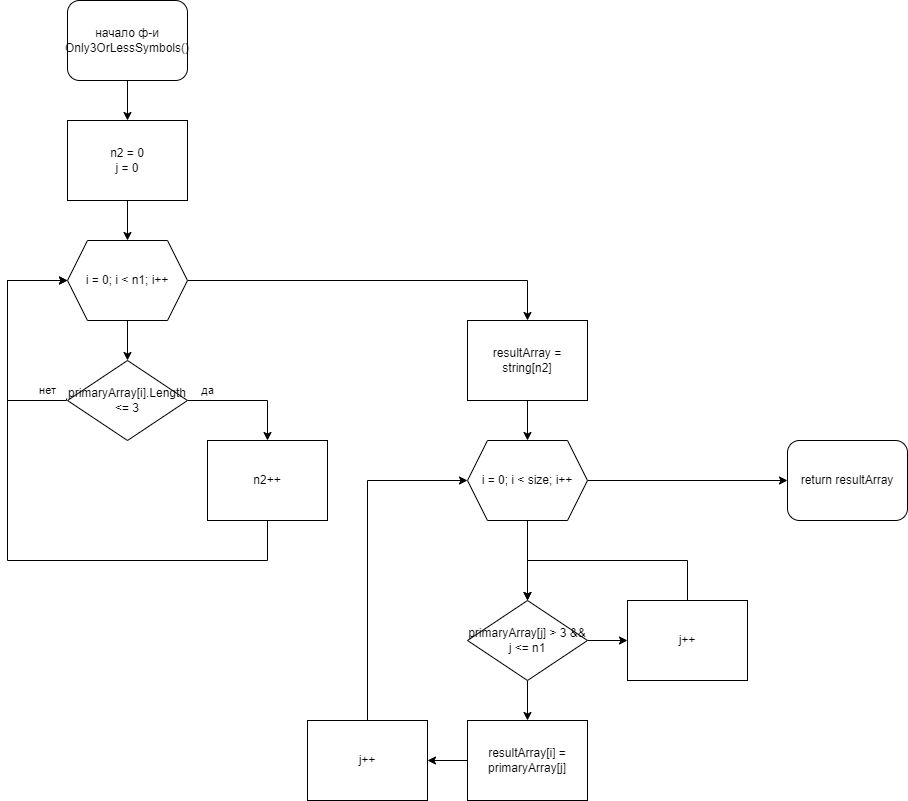

# README.md
Hi, this is a repository with the solution for a test problem. In this repository one can find 
- program file (Program.cs)
- file with explanation of this solution (README.md)
- picture of the scheme of solution (scheme.png)
Hope you won't find any bugs here. 

Program is written in *C#* and doesn't require any external library to run. Also here, in the README.md file we use the *Markdown* language.

## About task
The task consisted of 5 parts: 
1. The first one is **to create a repository on GitHub**.
2. The second one is **to draw a scheme** to solve the problem. 
3. The third one is **to create a readme file** using the markdown.
4. The fourth one is **to create a ptogram** to solve the problem.
5. And the fifth one (though it's more like a condition) is **to do several commits**.

#### The problem
Write a program which would create a new array (array B) out of existing one (array A). Array A is an array of strings. Each string may contain totally different symbols and different amount of symbols. Array B must contain only strings from array A with the length of 3 symbols or less. Array A may be written by user via console or created by the programmer.

## The Program.cs file
The Program.cs file is a file that contains code for the application.

### Functions
- string[] *StringsInput*(int *n*) - a function to fill array A with strings. Parameter *n* is a number of elements in the array. Function returns an array of strings.
- void *PrintText*(string *text*, string[] *arr*, int *n*) - a function to print an array. Takes a string to print it right before the array (*text*), array of strings to print it (*arr*), and the number of strings in the array (*n*).
- string[] *Only3OrLessSymbols*(string[] *primaryArray*, int *n1*) - a function that solves the problem. Takes the initial array (*primaryArray*) and the number of elements on the initial array (*n1*), and returns a new array of elements with length of 3 or less symbols.
- double *InputNumber*(string *text*) - a function that takes input and tries to parse it to a number. If the input was correct, returns the number. Else gives you another chance to try to use your brains and input a number. Takes a string (*text*) to print it before getting an input.
- int *Positive*(string *text*) - same as the previous one, but tries if the number is natural. If the input was correct returns the number. Else gives you one more chance. Takes string (*text*) to print it before getting an input.

### Algorithm
I won't explain how all the functions work, they're kind of primitive and have captions. Here I'll just tell how it works in general.
1. The program requires you to input the number of strings in array. The number must be integer and positive.
2. The program checks if the input was correct.
3. If input is correct, the program will run a function and ask to fill in the array.
4. Once the array is created and not empty, the program will run a function to create a new array:
    - count all strings with required length;
    - create an array with the length equal to the number of suitable strings;
    - write all suitable strings to the new array via cycles and conditionals.
5. Print the new array.

Here is the main part of the program:

    int n2 = 0;
    for (int i = 0; i < n1; i++)
        if (primaryArray[i].Length <= 3) n2++;
    string[] resultArray = new string[n2];
    int j = 0;
    for (int i = 0; i < n2; i++)
    {
        while (primaryArray[j].Length > 3 && j <= n1) j++;
        resultArray[i] = primaryArray[j];
        j++;
    }
    return resultArray;

## The scheme.png file
The scheme.png file contains a scheme of a Only3OrLessSymbols function, where we run the main part of algorithm. Here you can find the file: [scheme](scheme.png)

And here you can see it:

## Have a nice day!